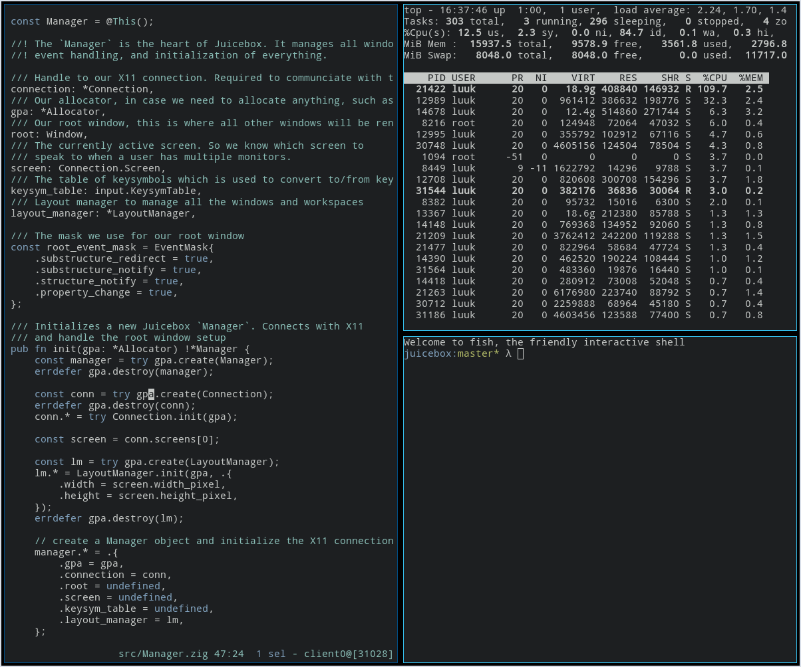

# Juicebox

Juicebox is a tiled window manager written in [Zig](http://ziglang.org) with **no** dependencies. Its implementation with the X protocol is written from scratch, and instead provides handy features to make it easier for the developer to work with, while still remaining low level.

## Features
- Multiple workspaces
- Configuration by modifying source code
- No dependencies, just a simple binary
- Small (code size, binary size, resource cost)

## Future goals
- Provide an async event loop for X11
  - Currently, we're using a simple blocking event loop to handle events, replies, errors from X11. However, Zig provides great primitives (async, suspend, etc) to create a custom event loop that will allow us to make the library itself a lot more efficient.
- General support for multiple screens
  - Also add support for Xinerama
- Allow to provide a config file during compilation to make configuring more sane. The high amount of keybindings makes it harder to read
- Provide a translation layer to connect to/with different bars such as [Lemonbar](https://github.com/LemonBoy/bar). (Perhaps a bar of its own).

### Screenshot
